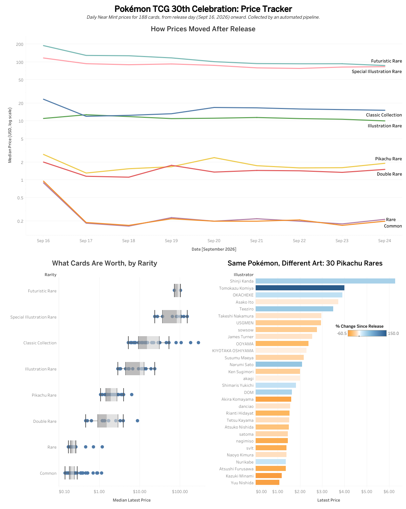

# Pokémon TCG 30th Celebration Price Tracker

I built this project to track the market prices of every card in Pokémon TCG's 30th Celebration set, which came out on September 16, 2026. A Python script collects prices every day and stores them in a PostgreSQL database, and I use SQL and Tableau to look at how the prices change.

**[View the dashboard on Tableau Public](https://public.tableau.com/views/PokmonTCG30thCelebrationPriceTracker/PriceTracker)**

## What I Wanted to Find Out

1. How do card prices change in the weeks after a set is released?
2. What makes one card worth more than another: its rarity, the Pokémon, or the artwork?

## What I Found So Far (as of September 24, 2026)

- Prices dropped for every rarity the day after release. The cheapest cards (Commons and Rares) fell from about $0.90 to about $0.20 and then stayed flat.
- The most valuable new cards (Futuristic Rares and Special Illustration Rares) are still slowly losing value.
- The Classic Collection reprints include the two most expensive cards in the set: Lugia and Charizard.
- Artwork matters. There are 30 Pikachu cards at the same rarity, and the only difference between them is the artist. Their prices range from about $1 to $6, and Shinji Kanda's Pikachu is the most valuable.

## How It Works

1. **Collect:** `fetch_prices.py` requests prices for all 188 cards from the JustTCG API and saves the results to a JSON file.
2. **Clean and load:** `load_prices.py` cleans the data (for example, separating card names from card numbers) and loads it into three tables in a Neon PostgreSQL database: `sets`, `cards`, and `price_history`.
3. **Automate:** GitHub Actions runs both scripts every morning, so new prices are added without me running anything.
4. **Add artist info:** `fetch_tcgdex.py` and `match_cards.py` pull each card's illustrator from a second API (TCGdex) and match it to the right card in my database.
5. **Analyze:** I wrote SQL views that compare each card's release-day price with its latest price, exported them to CSV, and built the dashboard in Tableau Public.

Two things I made sure of:

- Running the scripts again updates existing rows instead of creating duplicates, because each card can only have one price per day in the database.
- Each run re-downloads the last 30 days of prices, so if a daily run is missed, the next one fills in the gap.

## Choosing a Data Source

I tested three APIs before starting:

- **pokemontcg.io** didn't have prices for recent sets and sometimes returned errors.
- **TCGdex** didn't have prices for this set yet, so I used it for artist names instead.
- **JustTCG** had daily prices going back to release day, so I used it for prices.

## Limitations

- Prices are market averages, not individual sales, and release-day prices are based on only a few sales.
- I assumed all 30 Pikachu cards are equally easy to pull from packs. If some are rarer, that could explain part of the price difference.
- Only 2 cards are Futuristic Rares, so I can't draw strong conclusions about that rarity.
- The raw price data isn't included in this repo because JustTCG's terms don't allow sharing it.
- The three "RGB Mew" secret rares aren't on official card lists. JustTCG began tracking the G/RGB Mew on September 25, so it has no release-day price.

## What I Learned

- Working with APIs: reading documentation, requesting results page by page, and staying under rate limits.
- Designing database tables and writing SQL joins, views, and window functions for analysis.
- Scheduling scripts with GitHub Actions and keeping API keys private with secrets.
- Matching data between two sources that name the same cards differently.
- Choosing chart types in Tableau, like using a log scale when prices range from $0.10 to $300.

## Tools

Python (requests, psycopg2) · PostgreSQL (Neon) · SQL · GitHub Actions · Tableau Public

## Next Steps

- **After November 6:** check whether new product releases lower Classic Collection prices.
- **Mid-December:** update the dashboard and findings with the full release period.
